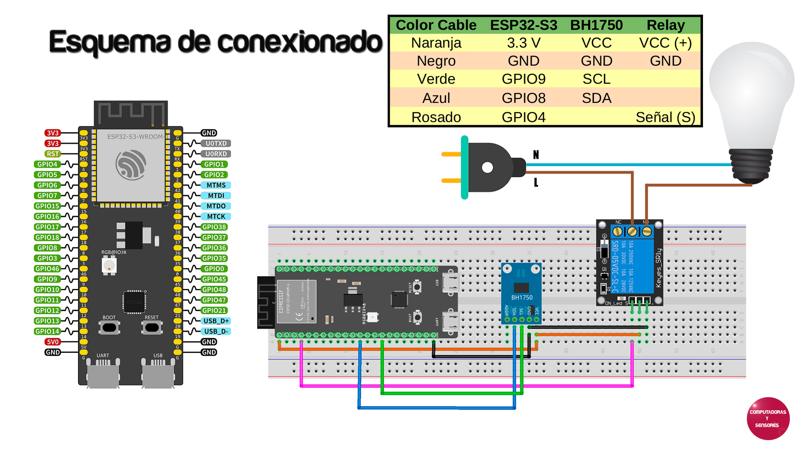

# BH1750 con ESP32-S3

Esquema de conexionado correspondiente al Capítulo 175 en YouTube de Computadoras y Sensores

# Librería para BH1750

https://github.com/PinkInk/upylib/blob/master/bh1750/bh1750/__init__.py

# Paso a paso

Video en YouTube: https://youtu.be/ameEJLHM0pk